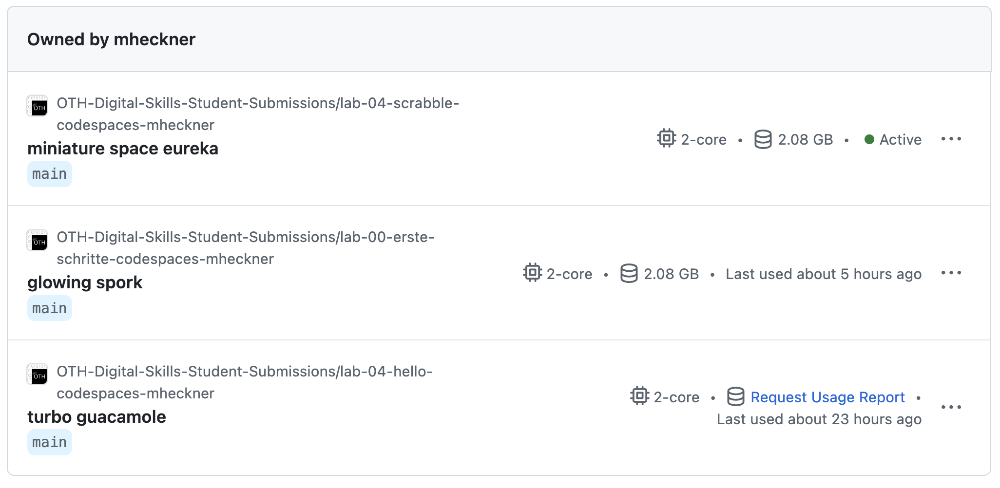

# Erste Schritte mit Codespaces
Um Code zu schreiben, werden Sie in den folgenden Challenges vorrangig Codespaces von GitHub verwenden. Sie benötigen dafür einen GitHub Account. GitHub wird von Einzelpersonen oder Teams verwendet, um zusammen an Code zu arbeiten und Änderungen daran zu verfolgen. In diesem Tutorial werden Sie Schritt für Schritt durch die Einrichtung von Codespaces geführt und erzeugen einen eigenen Codespace, den Sie im Lauf des Semesters für Tests und eigene Projekte verwenden können.

1. Registrieren Sie sich mit Ihrer studentischen E-Mail-Adresse bei [https://github.com/](https://github.com/)
2. Klicken Sie auf den folgenden [Link](https://classroom.github.com/a/jRu_6-ab)
3. Wählen Sie Ihren Namen aus der Liste (falls diese Liste angezeigt wird)
4. Klicken Sie in der geöffneten Webseite auf "Accept this assignment"
5. Klicken Sie in der aktualisierten Webseite auf den Link unter "Your assignment repository has been created:" (Der Link sieht in etwa wie der Folgende aus ```https://github.com/OTH-Digital-Skills-Student-Submissions/lab-00-erste-schritte-codespaces-ihrusername```)
6. Warten Sie ca. 30 Sekunden, bevor Sie weitermachen.
7. Klicken Sie auf den Button "<> Code", dann auf "Codespaces" und abschließend auf "Create codespace on main" - Es öffnet sich ein neuer Tab und ein Codespace wird für Sie eingerichtet.
8. **GANZ WICHTIG: Lassen Sie sich Zeit bevor Sie weitermachen:** Die erste Einrichtung eines neuen Codespaces kann mehrere Minuten dauern. Denken Sie an einen Stein, den Sie ins Wasser geworfen haben und warten Sie, bis das Wasser wieder völlig ruhig ist.

Ihr Codespace ist in die folgenden drei Bereiche unterteilt:

1. **Explorer** (auf der linken Seite) - Zeigt Ordner und Dateien an. Klickt man auf eine Datei wird diese im **Texteditor** geöffnet.
2. **Texteditor** (rechts neben dem Explorer) - Hier schreiben Sie Ihren Code
3. **Terminal** - Hier geben Sie die Befehle zum Ausführen Ihrer Programme und zum Wechseln von Ordnern ein.

Tippen Sie im Terminal den folgenden Befehl ein, gefolgt von der Enter-Taste, um einen neuen Ordner zu erstellen:

~~~shell
mkdir hello_world
~~~

Achten Sie auf den Explorer (auf der linken Seite). Sie können dort den neu erstellten Ordner sehen.

Vergessen Sie nicht das Leerzeichen zwischen ```mkdir``` und ```hello_world```. Auf diese Weise (d.h. eine Zeile, gefolgt von der Enter-Taste) geben Sie alle Befehle in den Terminal ein. Alle Befehle sind "case-sensitive", d.h. die Groß- und Kleinschreibung muss genau so sein wie in den Beispielen angegeben.

Geben Sie jetzt den folgenden Befehl ein (wieder gefolgt von Enter), um in den neu erstellten Ordner zu wechseln:

~~~shell
cd hello_world
~~~

Der Terminal sollte in etwa so aussehen und somit anzeigen, dass Sie den Ordner erfolgreich gewechselt haben:

~~~shell
/workspaces/lab-00-erste-schritte-codespaces-mheckner/hello_world (main) $
~~~

**Hinweis:** Der Text ```(main)``` gehört nicht zum Ordner. Sie können diesen Text ignorieren.

Erstellen Sie mit dem folgenden Befehl eine leere Pythondatei für Ihr erstes Programm:

~~~python
touch hello_world.py	
~~~

Tippen Sie auf dem Terminal den folgenden Befehl ein, um sich alle Dateien im Ordner ```hello_world``` anzeigen zu lassen:

~~~shell
ls
~~~

Die Ausgabe sollte wie folgt sein (die Datei ```hello_world.py``` haben Sie zuvor mit ```touch hello_world.py``` angelegt):

~~~shell
ls
hello_world.py
~~~

Im Explorer (auf der linken Seite) können Sie jetzt auch sehen, dass diese Datei im Ordner ```hello_world``` erstellt wurde. Klicken Sie auf den Ordner, dann auf die neue Datei, um diese (noch leere) im Texteditor zu öffnen.

Erstellen Sie jetzt Ihr erstes Programm. Tippen Sie dazu den folgenden Code in den Texteditor, exakt so, wie hier dargestellt:

~~~python
def main():
  print("hello world!")

main()
~~~

Tippen Sie den folgenden Befehl im Terminal, um zu Testen, ob alles wie erwartet funktioniert:

~~~shell
python hello_world.py 
~~~

Ihr Programm sollte die folgende Ausgabe erzeugen:

~~~shell
hello world!
~~~

Glückwunsch! Sie haben erfolgreich ihr erstes Python-Programm mit Codespaces geschrieben!

## Pro Aufgabe ein Codespace
Im Lauf des Kurses werden Sie mehrere Codespaces erstellen. Sie finden alle Ihre erstellten Codespaces unter dem folgenden Link: [https://github.com/codespaces/](https://github.com/codespaces/). Diese Seite sieht wir folgt aus und zeigt auf dem Beispiel drei Codespaces:




Die Codespaces haben zufällig generierte Namen wie "fuzzy adventure" oder "expert space pancake". Sie können den Codespace durch Klick auf diesen Fantasienamen öffnen. Über dem Codespace steht eine Zeile, anhand derer Sie rausfinden können, zu welcher Aufgabe der Codespace gehört, z.B.:
  * ```OTH-Digital-Skills-Student-Submissions/lab-00-erste-schritte-codespaces-mheckner``` ist der Codespace für dieses Tutorial
  * ```OTH-Digital-Skills-Student-Submissions/lab-04-hello-codespaces-mheckner``` ist der Codespace für die Aufgabe hello
  * usw.


## FAQs und Troubleshooting:
* Sollte ihr Codespace die Befehle ```check``` und ```submit```nicht verstehen, haben Sie wahrscheinlich nicht lange genug gewartet und eine Eingabe im Terminal gemacht, bevor der Codespace vollständig konfiguriert wurde. Richten Sie den Codespace wie folgt neu ein: "Shift + Cmd + P" (Mac) oder "Ctrl + Shift + P" (Windows). Geben Sie in das jetzt erschienene Eingabefeld den folgenden Text ein ```>Rebuild Container``` und wählen in dem sich öffnenden Dialog anschließend **Full Rebuild**. Anschließend noch geduldiger warten.
* Codespace sagt, er sei im Recovery Mode - Führen Sie ebenfalls einen Full Rebuild durch (siehe oben)
* Github meldet, dass Sie zu viele "running" Codespaces haben. Es dürfen nur maximal 2 Codespaces aktiv sein. Die Codespaces stoppen sich normalerweise automatisch 30min nach der letzten Verwendung. Um einen Codespace manuell zu stoppen, rufen Sie den Link [https://github.com/codespaces/](https://github.com/codespaces/) auf, klicken neben einem Codespace der als "active" markiert ist auf die drei Punkte und stoppen dann den Codespace (nicht löschen!).
* Wie stellen wir fest, welche Abgabe bewertet werden soll, falls Sie eine Abgabe mit replit und eine Abgabe mit Codespaces gemacht haben? Wir bewerten die bessere der beiden Lösungen.
* Damit Codespaces funktioniert, belassen Sie die Standardeinstellungen Ihres Browsers bzgl. Sicherheit bitte bei und verschärfen diese nicht (wenn Sie nicht wissen, was dies bedeutet, haben Sie aller Wahrscheinlichkeit nach kein Problem mit Codespaces)
