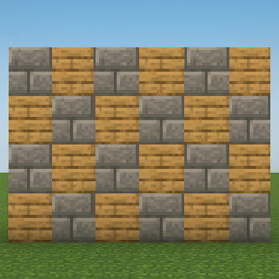
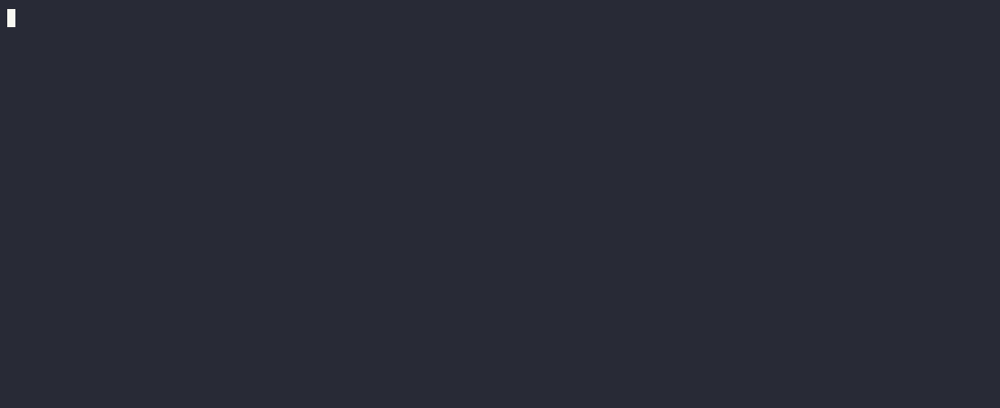

# Blocks

## Vorbereitung
1. Klicken Sie auf den folgenden [Link](https://classroom.github.com/a/Fnn1ayqo)
2. Wählen Sie Ihren Namen aus der Liste (falls diese Liste angezeigt wird)
3. Klicken Sie in der geöffneten Webseite auf **“Accept this assignment”**
4. Klicken Sie in der aktualisierten Webseite auf den Link unter **“Your assignment repository has been created:”**
5. **Warten Sie ca. 30 Sekunden, bevor Sie weitermachen!**
6. Klicken Sie auf den Button **“<> Code”**, dann auf **“Codespaces”** und abschließend auf **“Create codespace on main”** – Es öffnet sich ein neuer Tab und ein Codespace wird für Sie eingerichtet.
7. **GANZ WICHTIG:** Lassen Sie sich Zeit bevor Sie weitermachen: Die erste Einrichtung eines neuen Codespaces kann mehrere Minuten dauern. Denken Sie an einen Stein, den Sie ins Wasser geworfen haben, und warten Sie, bis das Wasser wieder völlig ruhig ist.

## Before you begin
Bevor Sie mit der Aufgabe starten, bedenken Sie bitte: Dieses Lab ist bewusst so gestaltet, dass Sie es ohne KI-Unterstützung lösen können. Warum sollten Sie das tun?
* Eigenes Problemlösen trainieren – Sie üben, Schritt für Schritt selbst zu analysieren, wie sich ein Problem mit Code lösen lässt.
* Grundlagen verstehen – Nur wenn Sie die Basis (Schleifen, Bedingungen, Variablen) selbst umsetzen, entwickeln Sie ein tiefes Verständnis für Programmierung.
* Langfristig selbstständiger werden – Wenn Sie Aufgaben ohne KI meistern, können Sie später auch komplexere Herausforderungen souverän lösen – mit oder ohne Unterstützung von Tools.

## Specs

**Achtung:** Lesen Sie zuerst das komplette Lab durch, bevor Sie mit der Bearbeitung beginnen!

Im Spiel **Minecraft** benötigen Sie für eine sichere Nacht eine solide **Mauer**, um sich vor den Zombies zu schützen – genauer: eine quadratische Mauer aus Blöcken.  
Ihre Aufgabe ist es, diese **quadratische Mauer** in Python auf der Kommandozeile (nicht als Pixelgraphik!) nachzubauen, wobei jedes Element der Mauer aus einem ```#```-Symbol oder einem `*`-Symbol besteht (stellen Sie sich jedes ```#``` und jeden `*` als einen Minecraft-Block vor), so ähnlich wie in der folgenden Abbildung:



Sie schreiben das Programm `blocks.py`, das die Mauer als Quadrat auf der Kommandozeile ausgibt.

Das Programm soll die Nutzer:innen nach der **Größe** der Mauer fragen: Ganzzahlen zwischen **1** und **8** inklusive sind korrekte Größen für eine Mauer.

Beispiel für eine Mauer der Größe `4` (4 Zeilen, 4 Zeichen pro Zeile):
~~~
#*#*
*#*#
#*#*
*#*#
~~~

Wenn die Nutzer:innen `4` eingeben, funktioniert ihr Programm so:

~~~shell
$ python blocks.py
Size: 4
#*#*
*#*#
#*#*
*#*#
~~~

Und so sieht es bei einer Eingabe von `2` aus:

~~~shell
$ python blocks.py
Size: 2
#*
*#
~~~~

Und so bei einer Eingabe von `1`:

~~~shell
$ python blocks.py
Size: 1
#
~~~~

Falls keine gültige Zahl zwischen `1` und `8` eingegeben wird, soll das Programm die Nutzer:innen so lange weiter zur Eingabe auffordern, bis eine korrekte Zahl eingegeben wird:

~~~shell
$ python blocks.py
Size: -1
Size: 0
Size: 42
Size: 9
Size: 8
#*#*#*#*
*#*#*#*#
#*#*#*#*
*#*#*#*#
#*#*#*#*
*#*#*#*#
#*#*#*#*
*#*#*#*#
~~~~

Hinweis zur Darstellung: In der Konsole sind ```#``` minimal höher als breit und die vertikalen Zeilenabstände sind größer als die horizontalen Abstände zwischen den Zeichen – das Quadrat wirkt dadurch optisch leicht hochkant. Das ist hier in Ordnung.

## Demo



## Schritt für Schritt

### Pseudocode

Erstellen Sie sich zuerst mit dem folgenden Befehl eine Datei ```pseudocode.txt```:

~~~shell
touch pseudocode.txt
~~~

Öffnen Sie diese Datei im Texteditor von Codespaces. Schreiben Sie in diese Datei einen Pseudocode, d.h. eine Abfolge von Schritten, die das Programm durchführen muss, auch wenn Sie noch nicht genau wissen, wie der exakte Python Code dafür lauten soll. Ein paar knappe Sätze reichen. In den Slides zur ersten Python-Sitzung finden Sie ein Beispiel für Pseudocode. Ihr Pseucode wird wahrscheinlich Funktionen, Schleifen und Verzweigungen enthalten.

Spoiler - Lesen Sie nicht weiter, wenn Sie den Pseudocode selbst schreiben wollen!

Es gibt viele Varianten den Pseudocode zu schreiben, die ist nur eine Variante:

~~~
1 User nach Größe fragen
2 Wenn Größe weniger als 1 oder mehr als 8 (oder garkeine Ganzzahl ist) wieder bei 1 anfangen
3 Iteriere von 1 bis zur Größe und
	Gebe in Iteration i, i # bzw. * Zeichen aus und anschließend eine neue Zeile
~~~

### User nach Input fragen

Beginnen Sie damit (egal, wie Ihr Pseudocode aussieht) den Code zu schreiben, der die Nutzer:innen (wiederholt) dazu auffordert eine Höhe einzugeben. Öffnen Sie dazu die Datei ```blocks.py``` in Codespaces. 

Passen Sie ```blocks.py``` jetzt so an, dass das Programm die Nutzer:innen immer wieder auffordert eine zulässige Zahl zwischen 1 und 8 einzugeben und speichern Sie dieses Ergebnis in einer Variable ab. Geben Sie dann die gespeicherte Höhe wie folgt aus:

~~~shell
$ python blocks.py
Size: -1
Size: 0
Size: 42
Size: 50
Size: 4
Gespeichert: 4
~~~
**Achtung:**  Die Ausgabe `Gespeichert: 4` ist nicht Teil der fertigen Lösung. Sie soll ihnen lediglich helfen zu überprüfen, ob Sie die Größe der Mauer richtig in einer Variable speichern und wieder auslesen können. 

Tipps:

* Sie können einen formatierten String mit ```print(f"Gespeichert: {size}")``` ausgeben, wobei ```size``` eine Variable ist.
* Ganzzahlen lassen sich von den Nutzer:innen mit der Funktion ```get_int``` einlesen. Dazu müssen Sie die Funktion aus der Bibliothek ```cs50``` importieren.
* Eine ```while``` Schleife führt Code wiederholt aus

### Bauen Sie eine Mauer aus #-Zeichen

Nachdem das Programm die Eingabe der Nutzer:innen akzeptiert, geht es an die Ausgabe der Mauer. Eine Mauer aus gleichen Zeichen lässt sich leichter ausgeben:

~~~shell
########
########
########
########
########
########
########
########
~~~

**Tipps:**

* Das ```#```-Zeichen (und natürlich auch der `*`) sind Zeichen wie jeder Buchstabe, die Sie einfach ausgeben können.
* Scratch bietet den Block "repeat" - In Python können Sie eine `for`-Schleife verwenden, um die Mauer auszugeben. 

* Schleifen mit `for` dienen in Python dazu Befehle öfter auszuführen. Zusätzlich können Sie aber auch bei jeder Wiederholung den Wert einer Zählvariablen ausgeben. Führt man den folgenden Code ...

  ~~~python
  size = 3
      for i in range(size):
          print(i)
  ~~~

  ... aus, dann wird auf der Kommandozeile das Folgende ausgegeben:

  ~~~shell
  0
  1
  2
  ~~~

  Jede Zeile steht für eine Wiederholung von `print(i)`. Die Ziffern `0`, `1` und `2` repräsentieren den Wert der Variable `i`, die nach jedem Durchlauf um 1 erhöht wird. Sehen Sie sich die Notes zur Vorlesung genau an, und überlegen Sie, wie Sie diese Informationen nutzen können, um zu unterscheiden, ob sie ein `#` oder einen `*` ausgeben sollen. Starten Sie mit der gleichen Abfolge für jede Zeile (d.h. jede Zeile beginnt mit einem `#`. Überlegen Sie erst dann, wie Sie die Zeichen zwischen den Zeilen abwechseln können).

* Sie können `for`-Schleifen auch mit zwei Zählvariablen verschachteln. Die äußere Schleife zählt dann die Zeilen und die innere die Zeichen innnerhalb der Zeilen.

## Testen

Testen Sie Ihren Code manuell mit den folgenden Eingaben. Funktioniert das Programm wie erwartet?

* ```-1``` - Oder andere negative Zahlen
* ```0```
* ```1``` bis ```8```
* ```9``` oder andere positive Ganzzahlen
* Buchstaben oder Wörter
* Keine Eingabe, wenn Die Nutzer:innen sofort Enter drücken

### Automatisierte Tests

Wenn alle manuellen Tests erfolgreich waren, können Sie Ihr Programm auch wie folgt automatisch auf dem Terminal testen. Verwenden Sie unbedingt in Ihrer Lösung die Funktion ```get_int```, um die Höhe der Mauer einzulesen, ansonsten funktionieren die Tests nicht korrekt.

```shell
$ check
```

## Abgabe

Geben Sie Ihr Programm mit dem folgenden Befehl auf dem Terminal ab:
```shell
$ submit
```

Hinweis: Sie können den obigen Befehl so oft ausführen wie Sie wollen. Bewertet wird immer der mit dem letzten Befehl hochgeladene Code.