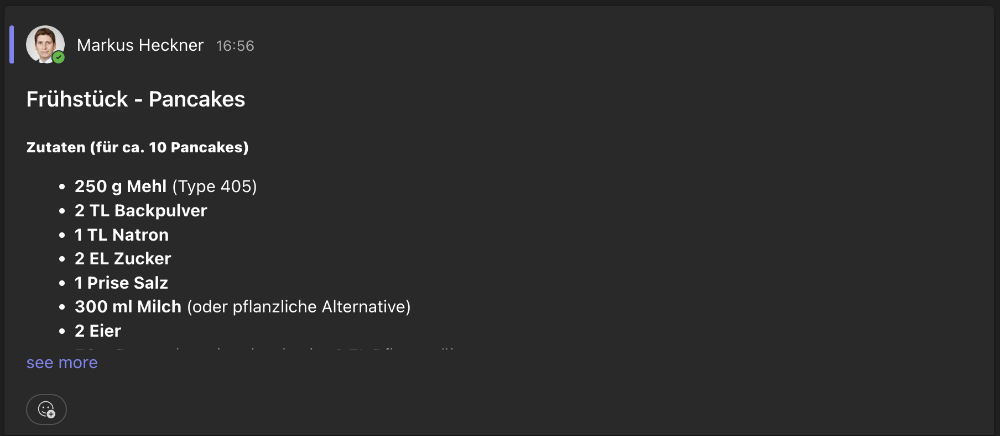

# Lieblingsrezepte
In dieser Aufgabe geht es um Rezepte: In einem Channel in Teams können Studierende ihre Lieblingsrezepte posten. Entwickeln Sie einen Flow in Power Automate, um über Rezepte benachrichtigt zu werden, für die Sie sich interessieren.

**ACHTUNG ACHTUNG ACHTUNG:** Es kann sein, dass Sie bereits über einen Microsoft Account über studisoft nach dem Muster ```abc12345@othr.onmicrosoft.com``` verfügen! Dies ist der falsche Account, der nicht für Teams und Power Automate freigeschaltet ist. Falls Sie sich in der Vergangenheit schon einmal mit diesem Account eingeloggt haben, gehen Sie bitte wie folgt vor:
* Loggen Sie sich bei https://teams.microsoft.com aus
* Loggen Sie sich bei https://make.powerautomate.com/ aus

Der korrekte Account ist nach dem Muster ```abc12345@hs-regensburg.de``` aufgebaut. ```abc12345``` müssen Sie durch Ihr eigenes NDS-Kürzel ersetzen.

Ein Rezept wird als neuer "Post" in diesem [Teams-Kanal](https://teams.microsoft.com/l/channel/19%3Aa754b9a8c7284d4fa01fed50a04d85bd%40thread.tacv2/Lieblingsrezepte?groupId=368c3b39-de3f-4141-bc4e-1c5cf45dc956&tenantId=2c1b9b13-893c-42a5-bbc1-d7a1db5ddb54) wie folgt erstellt (Tipp: Sie können Teams von Microsoft herunterladen oder im Browser nutzen): 

Der **Betreff** der Nachricht muss wie folgt aufgebaut sein: ```[Art der Mahlzeit] - [Name des Rezepts]``` (jeweils ohne die Klammern). Die Art der Mahlzeit muss dabei in der folgenden Auswahl enthalten sein:
* Frühstück
* Mittagessen
* Abendessen
* Snack
* Dessert

Beispiele für einen korrekten Betreff:
* Frühstück - Pancakes
* Abendessen - Spaghetti Carbonara
* Mittagessen - Züricher Geschnetzeltes 

Der **Inhalt** der Nachricht sollte das Rezept enthalten, kann aber ansonsten frei gestaltet werden. Der folgende Screenshot zeigt einen Beispiel:


## Vorbereitung
1. Loggen Sie sich mit dem Account nach dem Muster ```abc12345@hs-regensburg.de``` bei Power Automate ein: https://make.powerautomate.com/
2. Loggen Sie sich bei Microsoft Teams (ebenfalls mit ```abc12345@hs-regensburg.de```) ein (https://teams.microsoft.com/v2/) und klicken dort auf das Team "OTH_IM_DigitalSkills_Students"
3. Klicken Sie dort unter Hauptkanäle auf "Lieblingsrezepte". Eventuell finden Sie den Kanal unter "Ausgeblendete Kanäle".

Wenn Sie den Kanal Lieblingsrezepte sehen, ist alles korrekt eingerichtet, und Sie können loslegen (Sollten Sie den Kanal nicht sehen, melden Sie sich bitte über Piazza).

## Specs
* Erstellen Sie **einen** Flow in Power Automate, der Sie bei neuen Rezepten einer bestimmten Art per Mail informiert. Sie entscheiden dabei selbst, ob Sie sich über Rezepte der Kategorie Frühstück, Mittagessen, etc. informieren lassen wollen.
* Der Flow muss jedesmal eine neue Benachrichtigung erstellen, wenn ein neues Rezept im Kanal gepostet wird (bestehende Rezepte können Sie ignorieren)
* Sie geben im Flow an, über welche Art von Rezepten Sie informiert werden wollen. Über alle weiteren Rezepte, die nicht dieser Art entsprechen, werden Sie nicht informiert.
* Liken Sie mindestens 5 andere Rezepte in Teams, die Ihnen gefallen.

**Tipps:**
* Verwenden Sie den Auslöser "Wenn eine neue Kanalnachricht eingetroffen ist" und die Aktion "E-Mail Benachrichtigung erhalten" (NICHT: "E-Mail-Benachrichtigung senden (V3)", da Sie dafür nicht vom IT-Zentrum freigeschaltet sind).
* Es kann mehrere Minuten dauern, bis Sie eine Benachrichtigung erhalten.
* Denken Sie daran Ihren Flow zu deaktivieren, wenn Sie keine Benachrichtigungen mehr erhalten wollen.

## Testen
* Testen Sie mit einigen Beispielposts, ob Ihr Benachrichtigungsdienst korrekt funktioniert, d.h. Sie erhalten eine Benachrichtigung für die Art von Rezepten, für die Sie sich interessieren, über alle anderen Rezepte werden Sie nicht benachrichtigt.
* Lassen Sie gerne Ihre Lieblingsrezepte im Kanal, entfernen aber Testposts, die Sie nicht mehr benötigen.

## Abgabe
* Erstellen Sie ein kurzes Video (max. 1 Minute!) als Demo Ihres Flows (z.B. mit Zoom). In dieser Demo erläutern Sie den von Ihnen erstellten Flow in Power Automate und demonstrieren kurz, wie Sie einen Post erstellen und eine Benachrichtigung erhalten.  Tipp: Das Video können Sie beispielsweise mit Zoom erstellen. Starten Sie dazu eine "leere" Videokonferenz und nehmen das Video auf. Die Aufzeichnung können Sie sich anschließend herunterladen.
* Laden Sie das Video in ELO hoch.

**Pro-Tipp:** Wenn Sie Ihren Flow in den Übungen vorzeigen, müssen Sie kein Video erstellen! Laden Sie in diesem Fall lediglich ein Worddokument mit einem Text wie dem folgenden hoch: "Flow in der Übung vom [Datum] bei [Name des Dozierenden] vorgestellt".

## Punktevergabe
Sie können für diese Aufgabe maximal 2 Punkte erhalten.

