Note Challenge

Automation

[[toc]]


# Überblick zu Automation und Power Automate
Viele Unternehmen erledigen Dinge manuell mit hohem Personalaufwand und Potential für Fehler:

* Urlaubsanträge stellen und genehmigen
* Dokumente freigeben wie z.B. Mails an Kunden
* Daten zwischen verschiedenen Systemen synchron halten (z.B. Buchhaltungssystem und CRM)
* Rechnungen verarbeiten
* Meetingprotokolle verteilen
* usw.

## Was ist Power Automate?

* **Automatisierungstool** von Microsoft.
* Ermöglicht die **Automatisierung von Aufgaben** und **Workflows**, z. B. das Versenden von E-Mails oder das Synchronisieren von Daten zwischen verschiedenen Anwendungen. Dinge, die man ansonsten manuell tun müsste, lassen sich durch Power Automate digitalisieren.
* Funktioniert mit **vielen Microsoft-Diensten** wie Excel, Outlook, SharePoint, sowie **Drittanbieter-Apps** (z. B. X, Google Drive, Gmail).
* **Keine Programmierkenntnisse** erforderlich – **Power Automate** verwendet eine **grafische Oberfläche** für die Erstellung von Workflows (= Flows). Denken wie ein Programmierer hilft aber bei der Erstellung von Flows!
* **Zahlreiche Vorlagen** und **vorgefertigte Flows** erleichtern den Einstieg.
* Kann **manuelle Prozesse** ersetzen, wodurch Zeit gespart und **Fehler reduziert** werden können.

Power Automate ist Teil der Microsoft Power Platform und an der OTH für Studierende dieses Kurses verfügbar.


Bildquelle: https://learn.microsoft.com/de-de/power-apps/maker/data-platform/data-platform-intro

Was könnte man mit Power Automate automatisieren: Das Startup "My fresh pizza" verkauft Tiefkühlpizzen über das Internet und möchte seine Prozesse optimieren.


Bildquelle: ChatGPT

## Ticketsystem

**Szenario:**  "My fresh pizza" verfügt über eine Support-Emailadresse support@my-fresh-pizza.de, an die sich Kunden mit allen Anliegen wenden können. Die Anfragen müssen von zwei Supportmitarbeitern bearbeitet und manuell per Mail beantwortet werden. Ist einer der Mitarbeiter krank, weiß der andere nicht, wie der Stand der Bearbeitung ist. Auch ist es für das Team schwer nachzuvollziehen, welche Mails sie bereits beantwortet haben. Das Unternehmen möchte kein teures Ticketsystem einkaufen, sondern sucht nach einer Alternative.

**Mögliche Lösung:** Power Automate überwacht die Inbox von support@my-fresh-pizza.de und erstellt immer ein neues Ticket (bzw. eine Aufgabe) in dem Aufgabenmanagementtool Planner von Microsoft (oder in einem anderen Task-Manager, zu dem sich Power Automate verbinden kann). Alle neuen Tickets landen dabei in der Spalte "offen" und enthalten den Text der Mailanfrage, sowie die Absenderadresse. 

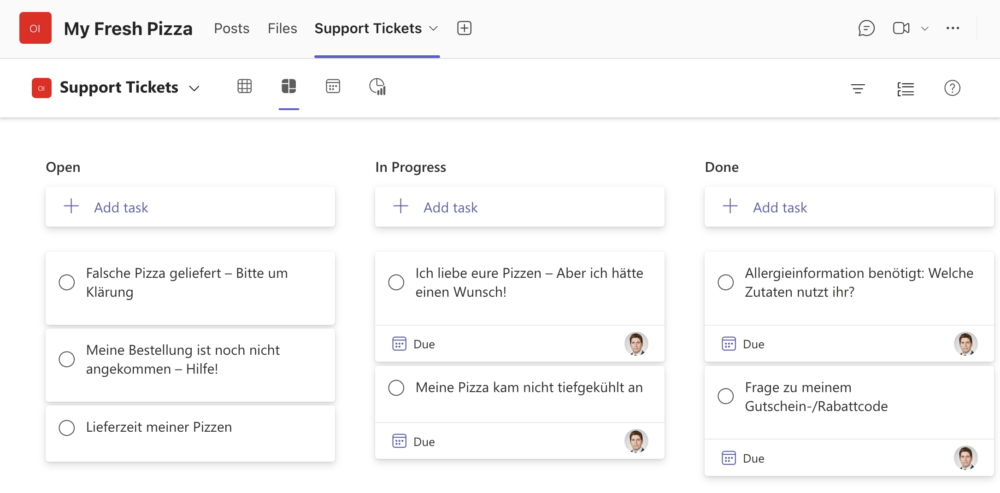

Die Mitarbeiter können sich Tickets, die sie bearbeiten selbständig in eine weitere Spalte "In Bearbeitung" ziehen. Sobald das Ticket bearbeitet wurde, können die Mitarbeiter das Ticket mit der Antwort kommentieren und in die Spalte "erledigt" verschieben. Daraufhin versendet Power Automate automatisch eine Mail an den Kunden und fügt den Kommentar des Mitarbeiters als Antwort ein. Der Status eines Tickets wird somit nachvollziehbar und die Supportmitarbeiter können auch bei Krankheit oder Urlaub des jeweils anderen Mitarbeiters weiter an den Tickets arbeiten.

## Urlaubsanträge

**Szenario**: "My fresh pizza" muss sicherzustellen, dass nicht alle Mitarbeiter zur selben Zeit in den Urlaub gehen, da ansonsten die Produktion und der Versand stillstehen würden. Daher müssen die Mitarbeiter und Mitarbeiterinnen eine Mail an ihren Vorgesetzten schicken, der den Urlaub dann genehmigen oder ablehnen kann. Vergisst der Vorgesetzte die Mail, kann es zu Wartezeiten kommen und viele Mails zwischen Mitarbeitern und Vorgesetztem gehen hin und her.

Beispielsweise lässt die folgende Mail eines Mitarbeiters viele Fragen offen:

> Betreff: Urlaub?
>
> Hey Chef,
>
> ich wollte mal fragen, ob ich nächste Woche oder irgendwann im Dezember ein paar Urlaubstage nehmen könnte. Hab das nicht genau durchgeplant, also wenn’s nicht passt, finden wir sicher eine andere Lösung.
>
> Sag einfach Bescheid, danke dir!
>
> Grüße
>  Chris

Weiterhin muss der Vorgesetzte manuell eine Excelliste mit den beantragten und genehmigten Urlauben pflegen.

**Mögliche Lösung:** "My fresh pizza" richtet eine Sharepoint-Liste ein, eine Art webbasiertes Exceltool mit Zeilen und Spalten. In diese Urlaubsantragsliste können die Mitarbeiter jetzt selbst eintragen, wann sie gerne in den Urlaub gehen wollen. Sobald ein neuer Eintrag von einem Mitarbeiter in der Liste erstellt worden ist, verschickt Power Automate automatisch eine Genehmigungsanfrage an den Vorgesetzten. 

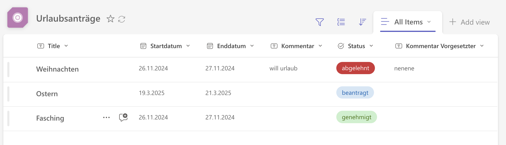

Dieser entscheidet dann und kann mit einem Klick den Antrag kommentieren und genehmigen oder ablehnen. Die Mitarbeiter werden automatisch über die Entscheidung informiert und die Liste mit den Urlaubsanträgen wird automatisch mit dem Ergebnis der Entscheidung aktualisiert. Somit werden Mails "eingespart" und der Status und das Ergebnis eines Antrags sind für alle transparent einsehbar. Der Vorgesetzte benötigt seine manuell gepflegte Urlaubsliste in Excel nicht mehr.

### Funktionsprinzip

In Power Automate lassen sich "Flows" erstellen, die den Ablauf der Automation steuern. Dazu lassen sich die folgenden Elemente kombinieren:

* **Trigger** - Jeder Flow benötigt einen Auslöser. Dieser kann **manuell** sein, z.B. durch einen Klick, oder durch **automatisch** durch ein Ereignis in einem Clouddienst (z.B. eine neue E-Mail trifft ein, ein neues Element in einer Liste wird angelegt, eine neue Zeile wird einem Excel-Dokument hinzugefügt) sein.
* **Aktionen** - Jeder Flow verfügt über eine oder mehrere Aktionen. Aktionen sind die Dinge, die ein Workflow "tun" kann, wie beispielsweise E-Mails versenden, Dateien abspeichern, Exceldokumente aktualisieren, Chatnachrichten schreiben, einen neuen Task in einem Taskmanagement-Tool anlegen, etc.

Die Entwicklung der Flows mit Triggern und Aktionen erfolgt dabei in einer graphischen Benutzeroberfläche (auch *low-code* genannt) und erlaubt Elemente, die auch in der klassischen Programmierung vorkommen, wie:

* Variablen
* Verzweigungen
* Schleifen
* Funktionen

Vgl. die folgende Abbildung für ein Beispiel eines Flows:

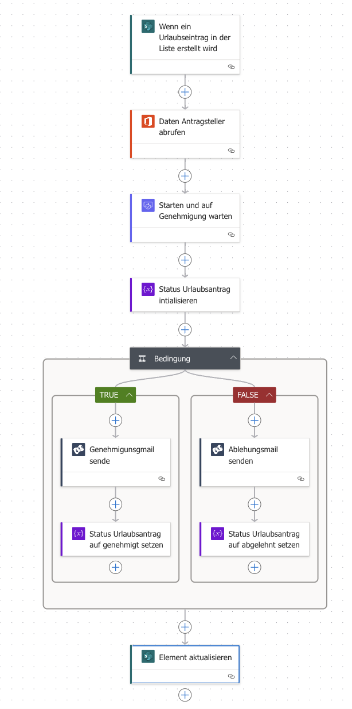

Im Hintergrund von Power Automate kommuninzieren die verbundenen Dienste über TCP/IP bzw. http, um Daten untereinander auszutauschen. Für den Benutzer wird die Kommunikation aber unter der Oberfläche versteckt. 

## Fazit Power Automate
* Power Automate verbindet sich mit verschiedenen Diensten
* Flows werden ausgelöst durch z.B. Änderungen in den verbundenen Diensten und lösen dann verschiedene Aktionen aus
* Power Automate ist der „Kleber“ zwischen unterschiedlichen Anwendungen

Im Folgenden wird erklärt, wie sich Flows in Power Automate erstellen, testen und veröffentlichen lassen.

# Power Automate - Zugriff, Verbindungen, Hello World, Eingaben, Bedingungen, Debugging und Funktionen 
## Zugriff auf Power Automate
Sie haben mit Ihrem Studierendenaccount bereits Zugriff auf Power Automate und können sich direkt dort einloggen: https://make.powerautomate.com/

Die Startseite von Power Automate sieht wie folgt aus:

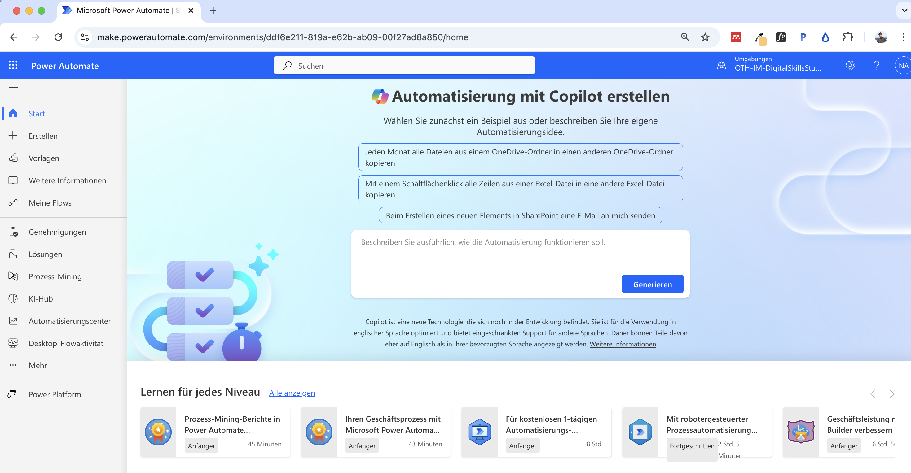

Dort finden sich die folgenden Bereiche:

* Navigationsleiste:
  * **Erstellen** - Neue Flows erstellen
  * **Meine Flows** - Übersicht bereits erstellte Flows
  * **Verbindungen (bei ... Mehr)** - Neue Verbindungen zu Clouddiensten erstellen und bestehende Verbindungen ansehen
* **Umgebungen** ist der Bereich in Power Automate, in dem die eigenen Flows erstellt werden - Sollte immer ```OTH-IM-DigitalSkills-Students``` sein

## Verbindungen

Eine Auswahl von Anwendungen mit denen sich Power Automate verbinden kann:

* **Sharepoint-Listen** - Webbasierte Listen aus Spalten und Zeilen, in denen sich Daten manuell oder automatisiert speichern lassen.
* **Dropbox** - Clouddienst zum Ablegen und Teilen von Dateien.
* **Dynamics** - CRM System von Microsoft zum Verwalten von Kundendaten.
* **Excel Online**
* **Google Dienste** z.B. Gmail, Google Drive, Google Sheets, Google Tasks
* **Jira**
* **Microsoft Dataverse** - Daten in der Microsoft Cloud speichern.
* **Microsoft Teams**
* **Notion** - Datenbankunterstütztes Wikitool
* **One Drive** - Clouddienst zum Ablegen und Teilen von Dateien von Microsoft.
* **One Note**
* **Planner**
* **Slack**
* **Survey Monkey**
* **Trello**
* **Vimeo**
* **X**
* **Youtube**
* **Zoom**

Eine vollständige, laufend aktualisierte Liste, finden Sie hier: https://learn.microsoft.com/en-us/connectors/connector-reference/connector-reference-powerautomate-connectors

Um sich direkt in Power Automate einen Überblick über mögliche und bestehende Verbindungen zu verschaffen, links im Menü (unter **... Mehr**) auf Verbindungen klicken. In der Suche lassen sich alle Dienste anzeigen, mit denen man sich verbinden kann (z.B. Planner oder Google Tasks). Legt man hier eine Verbindung an, kann diese in den Flows genutzt werden.

## Hello World
Als erstes Beispiel soll ein Flow erstellt werden, der eine Benachrichtung verschickt, wenn der Flow gestartet wird.

Einen neuen Flow können Sie bei Power Automate über den Link "+ Erstellen" in der Navigation erzeugen, vgl. die folgende Abbildung:

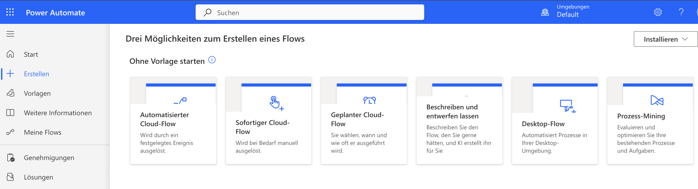

Im folgenden Beispiel soll eine einfache Hello World Demo erstellt werden, die eine Benachrichtung per Mail sendet, sobald die User auf einen Button klicken.

Dazu: **Sofortiger Cloudflow wählen** - Dies ist der Auslöser (**Trigger** für Ihren Workflow). Sie können Workflows auch automatisch auslösen, z.B. wenn Sie eine Mail erhalten.

In der Bearbeitungsansicht des Flows kann durch Klick nach dem Start des Flows eine Aktion hinzugefügt werden (E-Mail Benachrichtigung erhalten). Die Felder **Betreff** und **Textkörper** können angepasst werden, um den Inhalt der Benachrichtigung zu individualisieren:
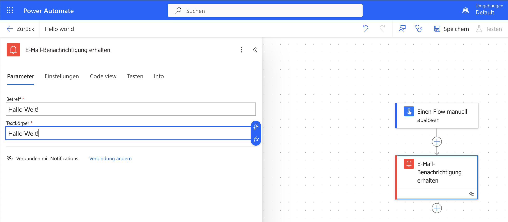

Anschließend den Workflow speichern und Testen. Achtung: Es kann mehrere Minuten dauern, bis Sie die Benachrichtigung erhalten.

## Eingaben
In Power Automate können Sie Eingaben aus vorhergehenden Schritten in späteren Schritten wieder verwenden. Das Hello World Beispiel lässt sich so anpassen, dass im Trigger eine Eingabe der Nutzer verlangt wird.

Im Folgenden soll ein Flow für eine Anmeldung zum Abendessen erstellt werden, der nur eine Benachrichtigung verschickt, wenn ein Nutzer zum Essen kommen kann.

Dazu wieder einen Flow mit einem manuellen Trigger erzeugen. Anschließend kann man durch Klick auf den Trigger weitere Daten von den Benutzern abfragen, vgl. folgender Screenshot.

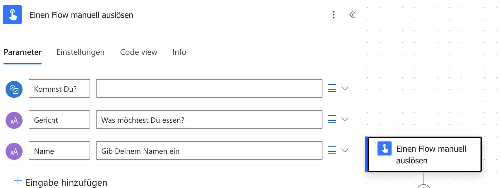

Erstellen Sie die Parameter wie dargestellt und testen anschließend Ihren Flow:


Die Eingaben aus Schritten eines Flows lassen sich in späteren Schritten wieder auslesen und weiterverwenden. In diesem Beispiel sollen die Informationen aus dem manuellen Trigger verwendet werden, um eine Bestätigungsmail zu verschicken. Klickt man auf die Aktion "E-Mail Benachrichtigung erhalten", lässt sich die Mail um Bausteine des vorherigen Schritts erweitern. Klickt man dazu in den Feldern **Betreff** oder **Textkörper** auf das **blaue Blitzsymbol**, öffnet sich ein Dialogfeld, und die Daten aus dem vorherigen Schritt lassen sich als Platzhalter einfügen.

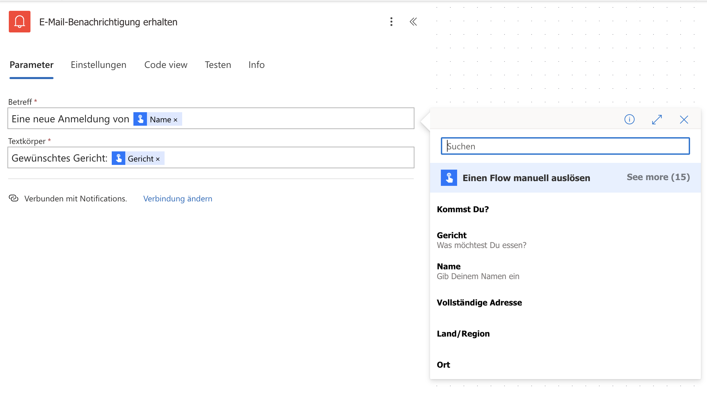

Die dann versendete Benachrichtigung sollte dann wie folgt aussehen:
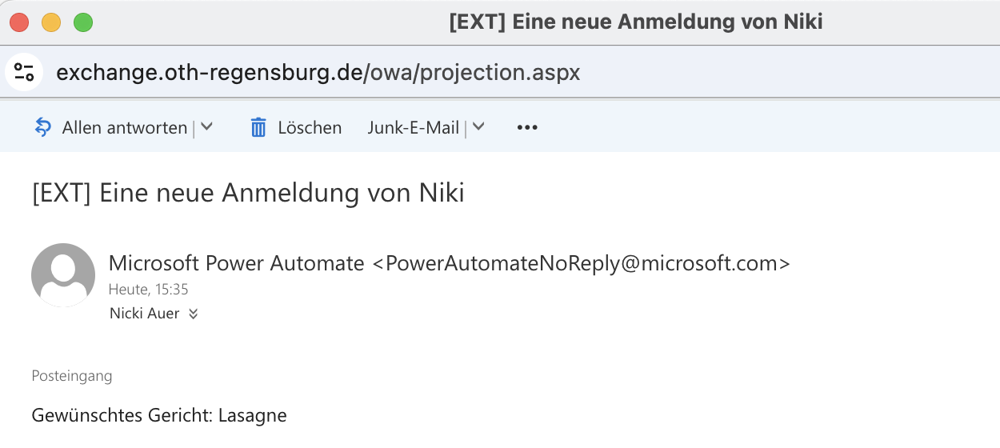

## Bedingungen
Die Benachrichtigung aus dem vorhergehenden Schritt wird jetzt immer versendet, diese soll aber nur versendet werden, wenn die User unter "Kommst Du?" ja gewählt haben, bzw. den Schalter eingeschaltet haben. Dazu kann ein neuer Schritt durch Klick auf das +-Zeichen und Auswahl von "Aktion hinzufügen" hinzugefügt werden. In der Suche kann jetzt nach "Bedingung gesucht werden". Die Bedingung erscheint daraufhin im Flow. Um die Benachrichtigung nur an Nutzer zu versenden, die auch kommen können, auf die Bedingung klicken und diese mit den Daten aus dem vorhergehenden Schritt befüllen und anschließend die Aktion zum Versenden in den Zweig "TRUE" der Bedingung verschieben. Das Ergebnis sieht wie folgt aus:

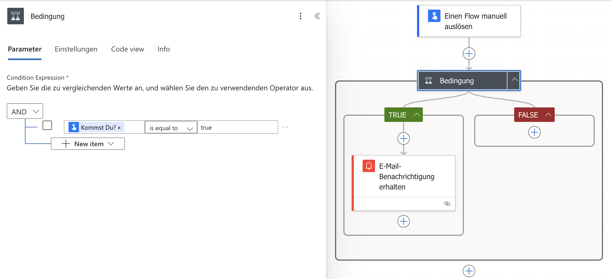

## Debugging
Um Fehler in einem Flow zu finden, lassen sich diese mit Power Automate debuggen. Dabei kann jeder einzelne Schritt des Flows überprüft werden, um den Grund für den Fehler zu finden. Im Folgenden Beispiel wird die Benachrichtigung nicht versandt, obwohl die Bedingung augenscheinlich korrekt implementiert wurde. Der Flow will eine Mail verschicken, wenn die Nutzer angeben, dass Sie kommen wollen. Dazu wird geprüft, ob in der Eigenschaft "Kommst Du?" der Wert "Ja" steht:
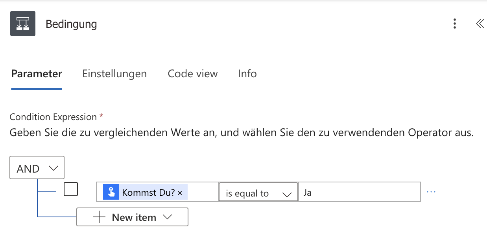

Testet man den Flow, kann man die Ausührung ansehen und erhält eine Abbildung wie die Folgende (dazu unter Meine Flows den Flow auswählen und auf der nächsten Seite unter Ausführungsverlauf auf das Datum der letzten Ausführung klicken):
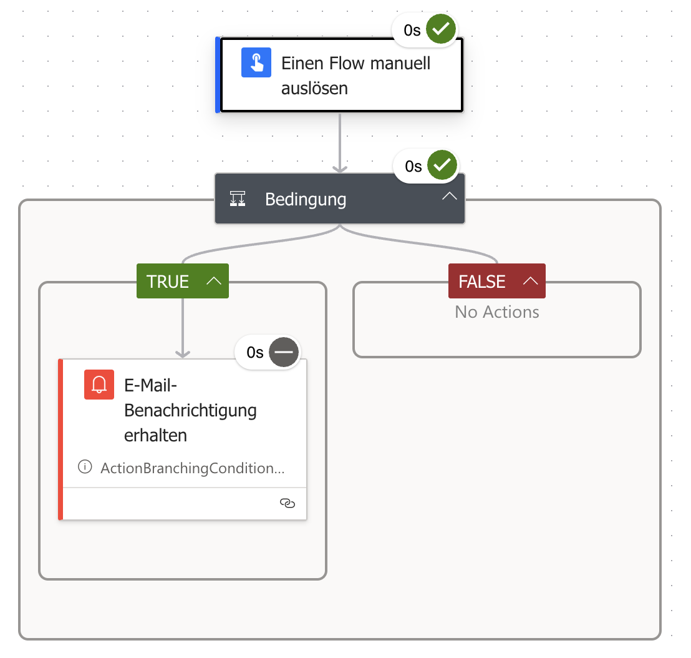

Die grünen Häkchen zeigen, dass der Flow ausgelöst wurde und die Bedingung geprüft wurde. Ebenfalls wird ersichtlich, dass der Zweig TRUE nicht ausgeführt wurde. Klickt man jetzt auf den Schritt vor der Bedingung (d.h. dahin wo die Daten zur Überprüfung der Bedingung herkommen sollen), dann wird unter "EINGABEN" ersichtlich, dass der Wert von "Kommst Du?" nicht "Ja" sondern ```true``` ist, die Prüfung der Bedingung kann also nicht wahr werden, da "Ja" nicht gleich ```true``` ist:
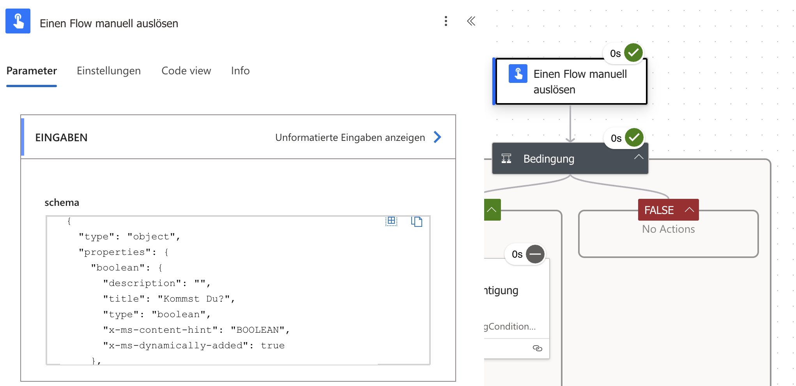
Um das Problem zu beheben, muss die Prüfung der Bedingung auf ```true``` angepasst werden, damit Prüfung und Daten aus dem vorhergehenden Schritt übereinstimmen.

## Funktionen
Power Automate verfügt über eingebaute Funktionen, welche die Erstellung von Flows erleichtern können, z.B.:

* ```concat()``` zum Zusammenfügen mehrerer Strings
* ```substring()``` für das "Auschneiden" von Text aus einem längeren String
* ```toUpper()``` für das Umwandeln eines Strings in Großbuchstaben
* ```dateDifference()``` um die Zeitdifferenz zwischen zwei Datumsangaben zu ermitteln

Eine Funktion kann in Elemente eines Flows durch Klick auf das Symbol fx neben einem Eingabefeld eingefügt werden. Der Editor für Funktionen sieht wie folgt aus:

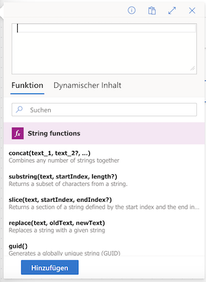

# Genehmigungsworkflows
Ein Genehmigungsworkflow in Power Automate hilft dabei, Genehmigungen für Aufgaben oder Entscheidungen einfacher und schneller zu organisieren. Dabei wird automatisch eine Anfrage an die zuständigen Personen geschickt, die dann direkt genehmigen oder ablehnen können – zum Beispiel per E-Mail oder in Microsoft Teams. Das Ergebnis wird festgehalten, und je nachdem, wie entschieden wurde, können automatisch weitere Schritte ausgelöst werden, wie das Verschicken von Dokumenten oder das Aktualisieren von Einträgen. So spart man sich Zeit, vermeidet Chaos und behält den Überblick.

Im folgenden Beispiel soll ein Flow erstellt werden, mit dem Mitarbeiter und Mitarbeiterinnen eines Unternehmens Urlaubsanträge stellen können, die dann genehmigt oder abgelehnt werden. Ziel des Flows ist es die Anträge und Entscheidungen an einer Stelle zu dokumentieren, anstatt den E-Mailverlauf mehrerer Personen durchsuchen zu müssen, wenn man wissen will, wie der Stand eines oder mehrerer Urlaubsanträge ist.

Der Flow soll wie folgt ablaufen:

* Urlaubsantrag wird ausgelöst durch einen Eintrag in einer Sharepoint Liste
* Genehmigende Person wird per E-Mail über den Antrag informiert und kann genehmigen (```Approve```) oder ablehnen.
* Flow prüft Ergebnis der Genehmigung und:
  * Schickt eine Mail an antragsstellende Person mit Ergebnis der Genehmigung
  * Aktualisiert die Sharepointliste mit Ergebnis der Genehmigung und Kommentar der genehmigenden Person

Dazu werden die folgenden Verbindungen benötigt:

* **Microsoft Sharepoint** für den Zugriff auf die Urlaubsliste und das Auslösen des Flows
* **Office 365 Benutzer** um Profildaten des Antragstellers auszulesen (hier wird der Vorname für eine personalisierte Benachrichtigung benötigt)
* **Starten und auf Genehmigung warten** um den Genehmigungsworkflow zu starten, die Benachrichtigung an den Vorgesetzten zu senden und auf das Ergebnis der Genehmigung zu warten.
* **E-Mail-Benachrichtigung senden (V3)** für das Versenden von Benachrichtigungen an den Antragsteller (im Video zu Challenge war diese Verbindung noch nicht korrekt durch das IT-Zentrum eingerichtet, daher werden diese Mails über den Anbieter SendGrid verschickt - Der Flow funktioniert mit beiden Verbindungen)
* **Bedingung** um auf das Ergebnis der Genehmigung zu reagieren.
* **Variablen** um sich das Ergebnis der Genehmigung zu "merken"


## Liste erstellen
Auslöser für den Workflow soll eine Sharepointliste sein. Listen sind online verfügbare "Tabellen" mit Zeilen und Spalten, die von verschiedenen Personen bearbeitet werden können. In Listen lassen sich Daten strukturiert sammeln, vergleichbar mit einer Exceltabelle. Listen können direkt im Web erstellt werden oder Teil eines Microsoft Teams sein. In diesem Beispiel wird eine Liste innerhalb eines Microsoft Teams verwendet. Die Liste sieht wie folgt aus:

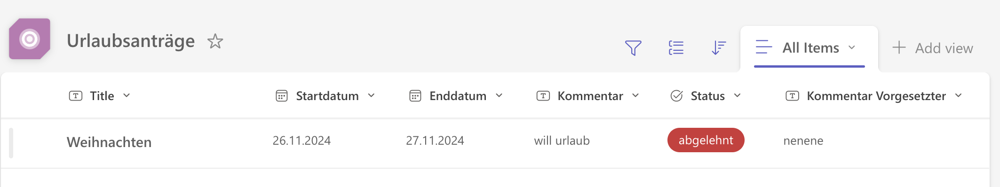

Die Spalten sind wie folgt:

* **Title** - Art des Urlaubs
* **Startdatdum** - Start des Urlaubs
* **Enddatum** - Ende des Urlaubs
* **Kommentar** - Kommentar der antragstellenden Person
* **Status** - Status des Antrags ist zu Beginn "beantragt", wechselt später, je nach Entscheidung auf "abgelehnt" oder "genehmigt"
* **Kommentar Vorgesetzter** -  In diese Spalte werden später die Kommentare der genehmigenden Person eingetragen.

#### Auslöser für den Flow erstellen und Benutzeprofil abfragen

Im ersten Schritt muss der Flow ausgelöst werden, der Auslöser soll ein Eintrag in der Sharepointliste sein. Dazu den Trigger "Automatisierter Cloud-Flow" wählen. Als Name bietet sich beispielsweise "Urlaubsantrag bearbeiten" an. Als Trigger für den Flow den Sharepoint Trigger "Wenn ein Element erstellt wird" wählen. Hier kann später die Urlaubsantragsliste ausgewählt werden. 

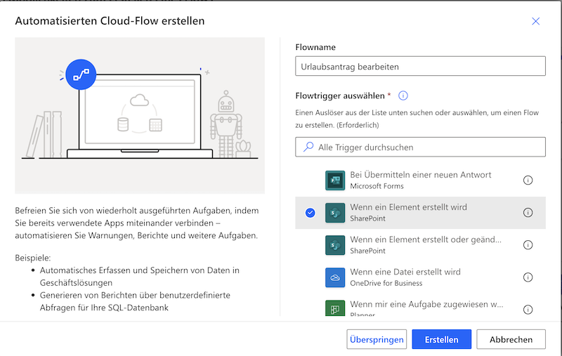

Nach dem Erstellen muss der Trigger noch umbenannt und die Liste gewählt werden. Dies sieht ungefähr so aus:

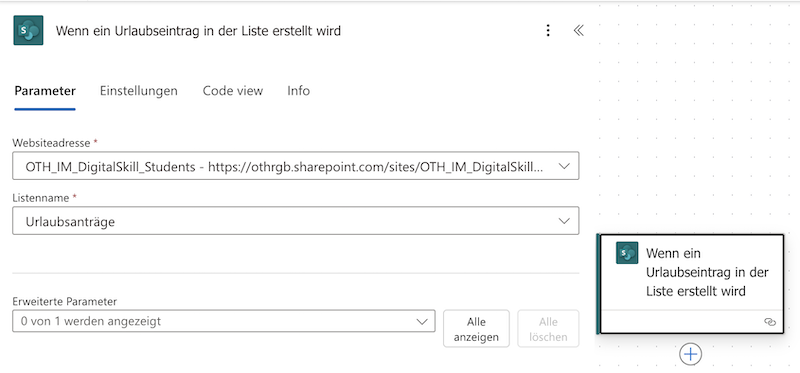

Im nächsten Schritt sollen Daten über die antragstellende Person aufgerufen werden, diese sollen später verwendet werden, um den oder die Antragstellerin in einer Infomail mit Vornamen begrüßen zu können. Dazu mit dem Connector "Office 365 Benutzer" eine neue Aktion "Benutzerprofil abrufen (V2)" hinzufügen. Diese Aktion benötigt die Informationen über das Nutzerprofil des Antragsstellers. Diese Daten lassen sich aus dem Trigger des Flows wie folgt auslesen (Klick auf Blitz und dann bei Benutzer "Author/Email" in das Feld Benutzer (UPN) aus dem Trigger eintragen). Dies bedeutet, dass die gerade erstellte Aktion als Eingabe die E-Mail bekommt und dann später als Ausgabe alle Daten zum Benutzer liefern soll.

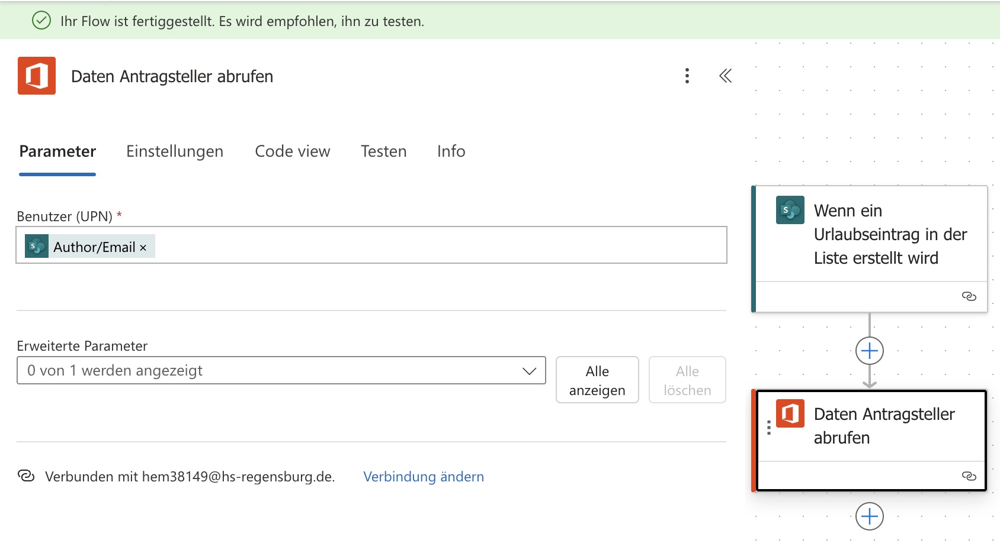Um zu testen, ob das Profil richtig abgerufen wird, jetzt den Workflow testen: Klick auf "Testen" in der Navigation, dann manuell wählen. Der Flow wartet jetzt auf den Auslöser (d.h. einen neuen Eintrag in der Liste). Erstellt man einen neuen Urlaubsantrag in der Liste aktualisiert sich die Testansicht und sieht wie folgt aus:

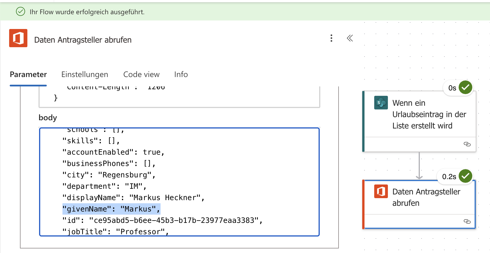

Die grünen Häkchen zeigen an, dass die Blöcke erfolgreich durchlaufen werden. Klickt man auf die Aktion "Daten Antragssteller abrufen", dann lässt sich auf der linken Seite kontrollieren, ob die Daten des Nutzerprofils richtig abgerufen wurden. In diesem Beispiel hat alles geklappt, da ```"givenName": "Markus"``` der richtige Vorname des antragstellenden Users ist.

## Starten der Genehmigung und Senden einer Anfrage an den Genehmiger
In diesem Schritt soll der Genehmigungsworkflow gestartet werden und die Antragssteller über das Ergebnis der Genehmigung informiert werden.

Zu Beginn muss dazu die Aktion "Starten und auf Genehmigung warten" aus dem Block "Genehmigungen" hinzugefügt werden. Als Genehmingstyp "Genehmigen/ablehnen: Erste Antwort" wählen, weil der Flow nach der ersten Antwort direkt weitergehen soll.

Die restliche Konfiguration sieht wie folgt aus:

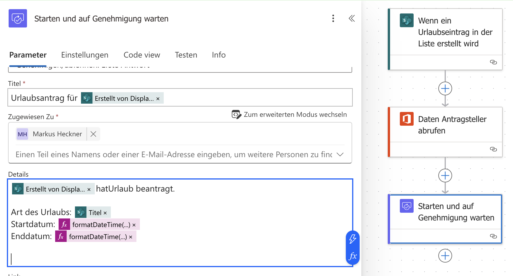

Die Felder bedeuten im Einzelnen (Erinnerung: Mit dem **Blitz** hinzufügen):

* **Titel:** Betreff der versendeten Mail
* **Zugewiesen zu:** Genehmiger des Antrags - Muss Benutzer der OTH Regensburg sein
* **Details:**  Text der Mail an den Genehmiger - Dieses Feld greift auf Daten aus dem Trigger des Flows ("Wenn ein Urlaubsantrag in der Liste erstellt wird") zu:
  * "Erstellt von DisplayName" - Name des Erstellers des Urlaubsantrags aus der Liste
  * "Titel" - Art des Urlaubs aus dem Listeneintrag

Zusätzlich wird den die Urlaubsdaten noch mit einer Funktion (Erinnerung: Mit **fx** hinzufügen) wie folgt in eine für Deutschland übliche Anzeige formatiert:

~~~
formatDateTime(triggerBody()?['Startdatum'], 'dd.MM.yyyy')
~~~

Erläuterung der Funktion:

* Die Funktion `formatDateTime` formatiert ein Datumsfeld in ein bestimmtes Format.

Erläuterung der beideen Parameter:

* ```triggerBody()?['Startdatum']``` - Greift auf das Feld `Startdatum` im Body (Inhalt) des Triggers zu. - Das Fragezeichen `?` sorgt dafür, dass der Zugriff nur erfolgt, wenn der Body und das Feld existieren. Falls nicht, wird ein Fehler verhindert und `null` zurückgegeben.
* ```Startdatum``` ist eine Eigenschaft aus der Liste.
* **`'dd.MM.yyyy'`**: Legt fest, wie das Datum dargestellt wird:
  - **`dd`**: Tag als zweistellige Zahl (01–31).
  - **`.`**: Punkt als Trennzeichen.
  - **`MM`**: Monat als zweistellige Zahl (01–12).
  - **`.`**: Punkt als Trennzeichen.
  - **`yyyy`**: Jahr mit vier Ziffern.

Der Flow lässt sich direkt Speichern und Testen: Der Flow sollte starten, wenn ein Item in der Liste hinzugefügt wird und eine Mail verschicken. Die Ansicht für den Genehmiger sieht wie folgt aus:

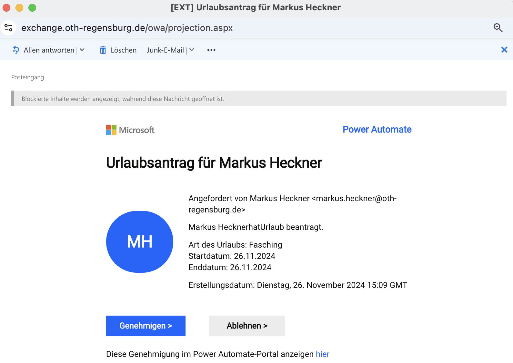

Klickt der Approver jetzt auf Genehmigen, kann noch ein Kommentar hinzugefügt werden und die Genehmigung abgesendet werden:


Die Testansicht sieht bei einem genehmigten Antrag wie folgt aus:

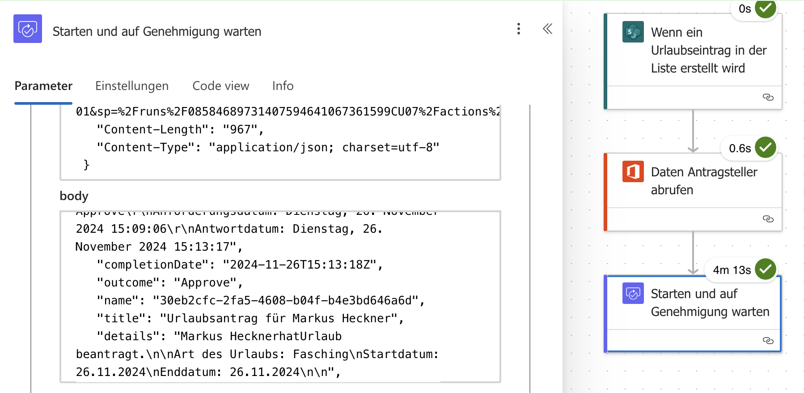

Entscheidend ist hier ```"outcome": "Approve"``` bei einer Genehmigung. Dieses Ergebnis wird im nächsten Schritt benötigt, um den Antragsteller über das Ergebnis zu informieren.

## Verarbeiten des Ergebnisses der Genehmigung und Informieren des Antragsstellers
In diesem Schritt soll der Antragsteller über das Ergebnis der Genehmigung informiert werden. Hierzu sind die folgenden Schritte notwendig:

* Einfügen einer Bedingung, um zu entscheiden welche Nachricht versendet werden soll.
* Benachrichtigungen entsprechen der Bedingungsprüfung zu versenden.

Um die Bedingung einzufügen eine neue Aktion mit + hinzufügen und nach Bedingung suchen. Wenn man die Bedingung anpasst, sieht das Ergebnis wie folgt aus:

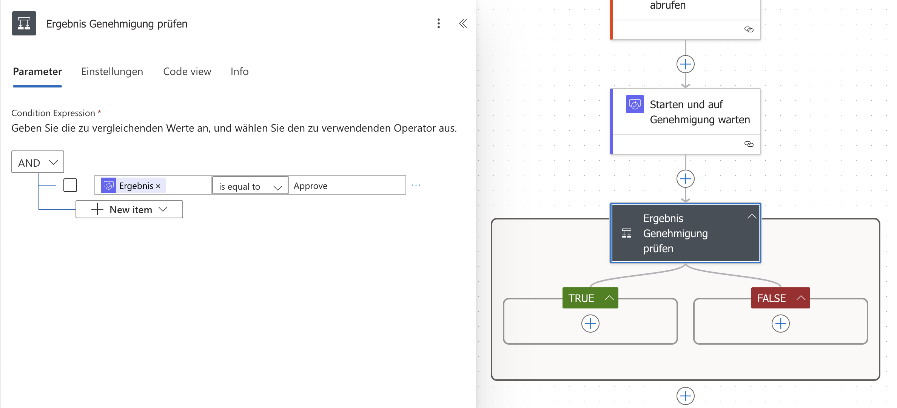

Der Wert links in der Bedingungsprüfung stammt aus der Aktion "Starten und auf Genehmigung warten" und kann wieder per Blitzsymbol eingefügt werden. Das Ergebnis ```Approve``` ist die Ausgabe des Schritts "Starten und auf Genehmigung warten" bei erfolgter Genehmigung (siehe oben) und darf nicht frei gewählt werden.

Durch das Klicken auf + bei True kann eine Mail versendet werden, diese kann wie folgt aussehen:

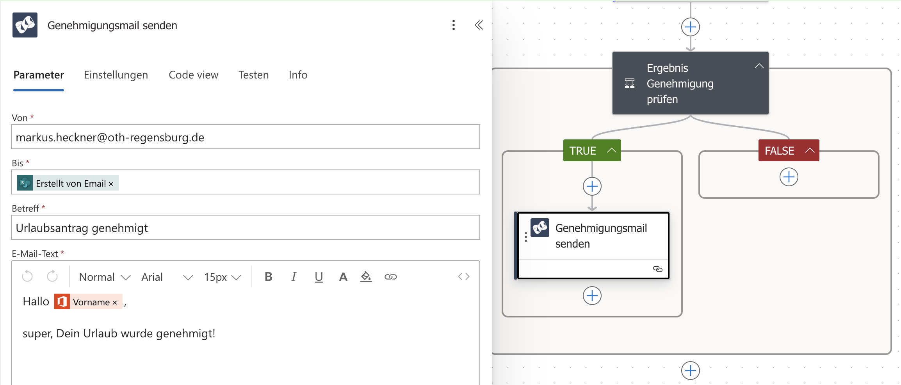

Hier wird der Vorname aus dem Schritt Daten Antragsteller abrufen eingefügt, um eine personalisierte Begrüßung in der Mail zu erhalten. Die Konfiguration der Mail für die Ablehnung erfolgt auf dem gleichen Weg. Testet man den Flow jetzt erhält der Genehmiger eine Mail, kann genemigen oder ablehnen und der Antragsteller wird per Mail über das Ergebnis informiert. Als letzter Schritt fehlt nur noch eine Aktualisierung der Urlaubsantragsliste, um sich schnell einen Überblick über den Stand aller Anträge verschaffen zu können.

**Achtung:** In diesem Beispiel erfolgt der Mailversand über den Connector SendGrid. SendGrid ist ein Anbieter für das Versenden von E-Mails für Unternehmenskampagnen. Wenn die Rechte korrekt konfiguriert sind, sollen sich Mails auch direkt über den Connector "E-Mail Benachrichtigung versenden (V3)" veschicken lassen.

## Variablen Sharepoint Liste aktualisieren und abschließend Testen
Im letzten Schritt soll zusätzlich noch die Sharepointliste aktualisiert werden. Die Liste ließe sich jetzt direkt in den Verzweigungen TRUE/FALSE aktualisieren, sollen dabei mehrere Felder aktualisiert werden, würde doppelter Code entstehen, da alle Änderungen an zwei Stellen gemacht werden müssten.

Um dieses Problem zu beheben, kann in Power Automate eine Variable ```Status Urlaubsantrag``` eingefügt werden, die in den Verzweigungen TRUE/FALSE auf den jeweiligen Wert gesetzt wird, der dann in der Liste aktualisiert werden soll, in diesem Fall ```genehmigt``` bzw. ```abgelehnt```.

Um die Variable anzulegen wie folgt vorgehen: Vor der Verzweigung per + eine Aktion "Variable initialisieren" einfügen, dann suchen nach "variable" und die Variable ```Status Urlaubsantrag``` initialisieren (diese braucht erstmal keinen Wert):

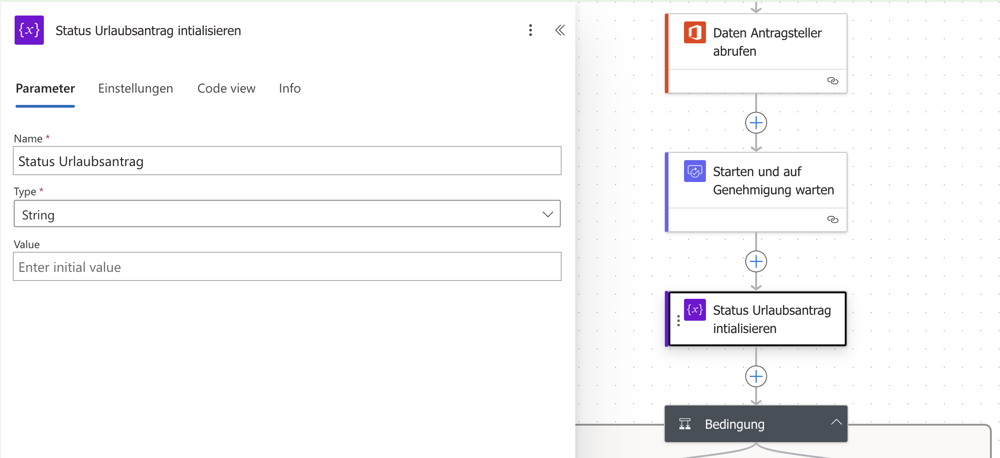

In der Bedingung kann jetzt der Wert der Variable gesetzt werden (wieder auf +, dann Suche nach Variable und anschließend Variable festlegen):

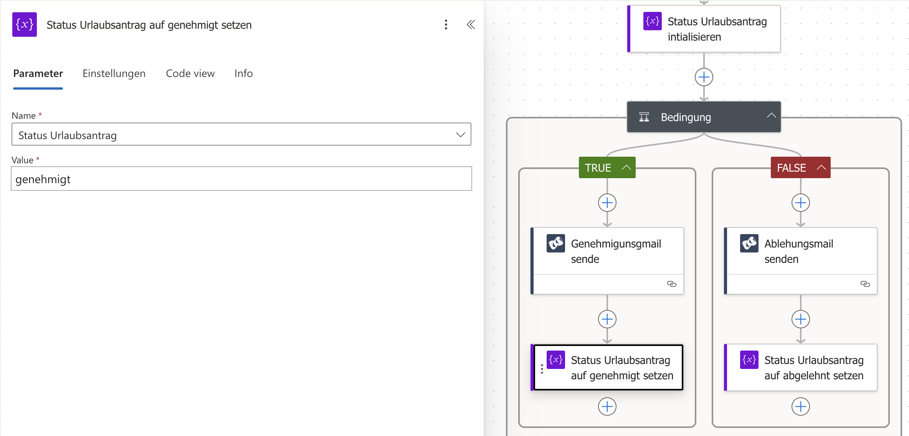

Um die Liste zu aktualisieren **nach** der Bedingung eine neue Aktion "Sharepoint - Element aktualisieren" einfügen. Hier die Liste auswählen und unter ID die ID des zu Beginn des Flows hinzugefügten Listeneintrags aus dem Trigger auslesen und für diese Aktion setzen. Jetzt noch den Wert von Status nutzen, um den Status im Listenelement zu setzen:

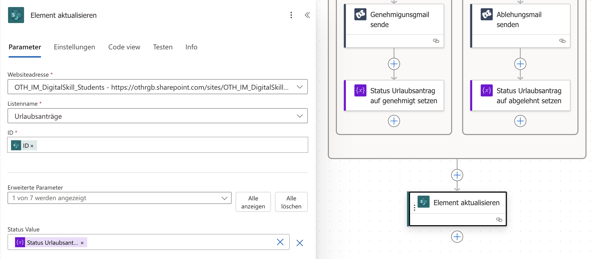

Der fertige Flow sieht dann wie folgt aus: 


# Demo: AI Workflow mit Bilderkennung

Auch Power Automate integriert mit dem **AI-Builder** KI Funktionen.

### Rechnungsscanner

**Idee:** Rechnungen analysieren und Informationen extrahieren.

**Trigger**: Sofortiger Cloudflow mit Upload einer Rechnung.

**Aktion:** Informationen mit AI-Builder aus der Rechnung extrahieren

**Aktion:** E-Mail mit extrahierten Informationen verschicken.

### Katalogbilder mit AI beschreiben

**Idee:** Für einen Katalog werden Bilder verwendet, die bisher immer manuell beschrieben wurden. Der Workflow soll dabei helfen die Bilder automatisiert zu beschreiben.

**Trigger**: OneDrive - Wenn eine Datei erstellt wurde

**Aktion:** Beschreibung eines Bilds generieren (Output englisch)

**Aktion**: Enschlischen Beschreibungstext übersetzen lassen

**Aktion:** SharePoint Liste - Element erstellen

